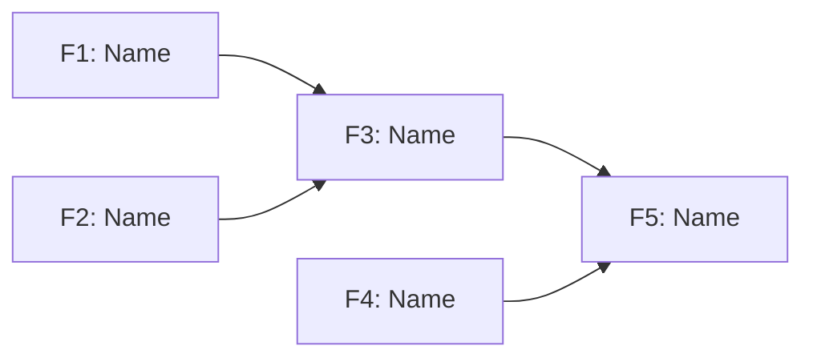

**Load skills:** @.claude/skills/command @.claude/skills/playbook @.claude/skills/testing

# PRD to Plan

Transform a PRD into an implementation-ready plan through three sequential phases.

## Process

1. Read `docs/{feature}/01-PRD.md`
2. **Phase 1:** Extract features → `02-FEATURES.md`
3. **Phase 2:** Create spec → `03-SPEC.md`
4. **Phase 3:** Create plan → `04-PLAN.md`

Ask clarifying questions between phases as needed.

---

# Phase 1: Features

Extract features from the PRD, organized around user journeys.

## Questions (if User Journeys unclear)

- What are the main user workflows?
- What actions does each workflow involve?
- What are the expected outcomes?

## Extraction Process

### 1. Parse User Journeys

- Extract each journey from PRD's User Journeys section
- Break into discrete steps (user actions + system responses)
- Identify the happy path and variant flows

### 2. Map Features to Journey Steps

- For each step, identify required features from Functional Requirements
- Features enabling the same step are peers
- Features in sequence have dependency relationships
- Flag features appearing in multiple journeys (high-value, implement first)

### 3. Build Dependency Graph

- Feature A enables Feature B if A's journey step precedes B's
- Identify parallel features (no dependency, can build concurrently)
- Detect features not in any journey (standalone utilities)

### 4. Identify Critical Path

- Longest chain of blocking dependencies
- These features gate the most downstream work
- Prioritize critical path features for early implementation

### 5. Detail Each Feature

- Map to source PRD section
- List which journeys use it
- Define acceptance criteria from journey context

## 02-FEATURES.md Template

````markdown
# Features - {Product Name}

## Context

{Summarize the PRD in a concise format so we have context for all the features}

---

## Summary

| Metric        | Value |
| ------------- | ----- |
| Features      | X     |
| Journeys      | X     |
| Critical Path | X     |

## User Journeys

### Journey 1: {Name}

{One-line description}

| Step | Action   | Features |
| ---- | -------- | -------- |
| 1    | {action} | F1, F2   |
| 2    | {action} | F3       |
| 3    | {action} | F4, F5   |

### Journey 2: {Name}

...

## Feature Graph


````

## Critical Path

Longest blocking chain - prioritize for early implementation:

`F1 -> F3 -> F5 -> F8`

## Feature Details

### F1: {Feature Name}

| Attribute  | Value           |
| ---------- | --------------- |
| Complexity | Low/Medium/High |
| Source     | PRD §{Section}  |
| Journeys   | 1, 2            |
| Enables    | F3, F4          |
| Blocked by | None            |

**Description:**
{What this feature does}

**Acceptance Criteria:**

- [ ] {Criterion derived from journey step}
- [ ] {Criterion from PRD requirements}

**Technical Notes:**
{Constraints, edge cases, integration points}

---

### F2: {Feature Name}

...

```

---

# Phase 2: Specification

Create technical specification from the features document.

## Questions (1-2 rounds max)

**Round 1 - Architecture:**

- Ambiguous integration points
- Unclear data flow
- Unspecified technology choices

**Round 2 (if needed):**

- Complex error handling
- State management concerns

## 03-SPEC.md Template

````markdown
# Technical Specification - {Product Name}

# Context

## From PRD

{Copy from 02-FEATURES.md Context verbatim}

## From Features

{Summary: feature count, critical path, key dependencies}

## Specification Summary

{Adaptive summary: 3-5 bullets covering key components, critical interfaces, safety constraints, and important patterns. Focus on information the planning step needs.}

---

## Overview

{1-2 sentence technical approach}

**Components:**

| Component | Type | Purpose |
| --------- | ---- | ------- |

**Architecture:**

```
{ASCII diagram}
```

**Design Decisions:**

- {Decision}: {Rationale}

---

## Feature Specifications

### F{n}: {Feature Name}

| Attribute      | Value                |
| -------------- | -------------------- |
| Source         | 02-FEATURES.md §F{n} |
| Components     | {list}               |
| New Files      | {list or None}       |
| Modified Files | {list or None}       |

**Interface Contract:**

| Method/Function | Input | Output | Errors |
| --------------- | ----- | ------ | ------ |

**Data Structures:**

| Name | Type | Fields | Purpose |
| ---- | ---- | ------ | ------- |

**Playbook Contract:** _(if applicable)_

| Variable         | Type   | Required | Description |
| ---------------- | ------ | -------- | ----------- |
| DEPLOYER\_{NAME} | string | Yes      | {purpose}   |

Output:

```yaml
status: success|error
```

**Integration Points:**

- {Class}: {usage}

**Error Taxonomy:**

| Condition | Message | Behavior |
| --------- | ------- | -------- |

**Edge Cases:**

| Scenario | Behavior |
| -------- | -------- |

**Security Constraints:**

- {requirement}

**Verification:**

- {observable outcome}

---
````

## Rules

- Spec every feature from 02-FEATURES.md
- Interface contracts: WHAT not HOW
- Error messages: exact user-facing text
- Integration points: reference existing classes
- Playbook contracts: env vars and YAML output only
- Verification: observable outcomes, not test cases

---

# Phase 3: Implementation Plan

Create actionable milestone-based implementation plan from the spec.

## Milestone Grouping

- Respect dependencies (no forward references)
- Group features modifying same file/component
- Each milestone independently verifiable
- Playbooks before PHP commands
- Core functionality before CLI options
- 2-4 features per milestone maximum
- **Parallel milestones:** When features have no dependencies between them, use suffix notation (2a, 2b) and annotate with `(parallel with N)`

## 04-PLAN.md Template

```markdown
# Implementation Plan - {Product Name}

# Context

## From PRD

{Copy from 03-SPEC.md Context verbatim}

## From Features

{Copy from 03-SPEC.md Context verbatim}

## From Spec

{Copy from 03-SPEC.md Specification Summary verbatim}

## Plan Summary

{Adaptive summary: 3-5 bullets covering milestone overview, file changes, parallel work opportunities, and key verification criteria. Focus on information the implementation step needs.}

---

## Overview

{1-2 sentence summary}

**Source:** [PRD](./01-PRD.md) | [FEATURES](./02-FEATURES.md) | [SPEC](./03-SPEC.md)

## File Changes

| Type | File     | Purpose       |
| ---- | -------- | ------------- |
| New  | `{path}` | {description} |
| Mod  | `{path}` | {changes}     |

## Prerequisites

**Reference Patterns:**

- `{existing-file}` - {pattern to study}

## Milestones

### Milestone 1: {Name}

| Features | F{n}, F{n} |
| -------- | ---------- |

**Deliverables:**

- {Concrete file or function}

**Steps:**

1. {Verb} {specific task}
1. {Next step}

**Integration:** {How this connects to existing code}

**Verification:**

- [ ] {Testable criterion}

**Enables:** Milestone {n}

---

### Milestone 2a: {Name} (parallel with 2b)

| Features | F{n} |
| -------- | ---- |
| Parallel | 2b   |

**Deliverables:**

- {Concrete file or function}

**Steps:**

1. {Verb} {specific task}

**Integration:** {How this connects to existing code}

**Verification:**

- [ ] {Testable criterion}

**Enables:** Milestone 3

---

## Implementation Notes

{Cross-milestone guidance, error handling summary from SPEC}

## Completion Criteria

- [ ] All milestones verified
- [ ] Quality gates pass
- [ ] Manual test against PRD user journeys
```

## Rules

- Reference 03-SPEC.md sections, don't duplicate contracts
- Steps start with verb (Create, Add, Extract, Update, Wire)
- Steps name exact functions, files, variables
- Code snippets show signatures/patterns, not full implementations
- Verification manually testable without test suite
- Note integration points explicitly
- Identify parallel opportunities from Features Summary's critical path
- Milestones with no shared dependencies can be marked parallel

---

# Output

1. `docs/{feature}/02-FEATURES.md` - Feature breakdown with dependency graph
2. `docs/{feature}/03-SPEC.md` - Technical specification with contracts
3. `docs/{feature}/04-PLAN.md` - Implementation plan with milestones
